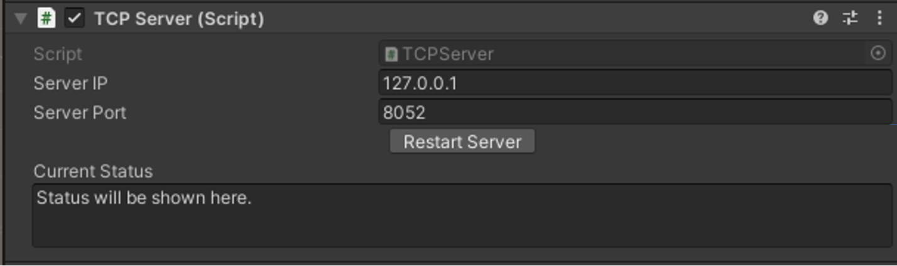
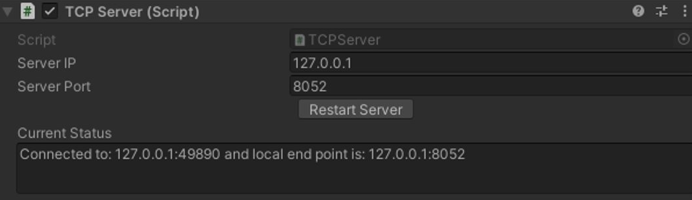
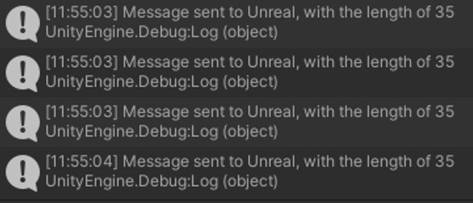
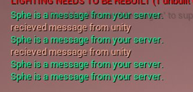
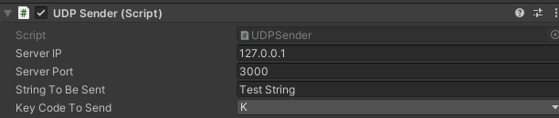

# Unreal-Unity Communication Package
A bundle of Unreal Project and a Unity Project pre-configured to facilitate inter-communication between both engines.

# Working
We can create server/clients at Unity/Unreal to cross-communicate between them. Technically, there isn't anything special that is happening in these projects. Networking is being used on both ends to communicate but I have bundled them together because of necessity. 

## 1. TCP Server:

You can specify the IP/Port over which the server would be 


<b> Server IP/Port: </b> Self explanatory ip/port of the server we will be hosting.
<br>
<b> Current status: </b> Self explanatory / shows the current status.

### After it connects:


### Sending messages:


### Unreal Recieving:


## 2. UDP Server:
Works pretty much the same way

### UDP Sender:
Allows you to send UDP packets.


 
## 3. Windows testing:

### For testing UDP Server/Packets quickly from the CLI:


<b> Send UDP Packets: </b>
```powershell
function Test-NetConnectionUDP {
    [CmdletBinding()]
    param (
        # Desit
        [Parameter(Mandatory = $true)]
        [int32]$Port,

        # Parameter help description
        [Parameter(Mandatory = $true)]
        [string]$ComputerName,

        # Parameter help description
        [Parameter(Mandatory = $false)]
        [int32]$SourcePort = 50000
    )

    begin {
        # Create a UDP client object
        $UdpObject = New-Object system.Net.Sockets.Udpclient($SourcePort)
        # Define connect parameters
        $UdpObject.Connect($ComputerName, $Port)
    }

    process {
        # Convert current time string to byte array
        $ASCIIEncoding = New-Object System.Text.ASCIIEncoding
        $Bytes = $ASCIIEncoding.GetBytes("$(Get-Date -UFormat "%Y-%m-%d %T")")
        # Send data to server
        [void]$UdpObject.Send($Bytes, $Bytes.length)
    }

    end {
        # Cleanup
        $UdpObject.Close()
    }
}
```

<b> Start UDP Server: </b>
```powershell
function Start-UDPServer {
    [CmdletBinding()]
    param (
        # Parameter help description
        [Parameter(Mandatory = $false)]
        $Port = 10000
    )
    
    # Create a endpoint that represents the remote host from which the data was sent.
    $RemoteComputer = New-Object System.Net.IPEndPoint([System.Net.IPAddress]::Any, 0)
    Write-Host "Server is waiting for connections - $($UdpObject.Client.LocalEndPoint)"
    Write-Host "Stop with CRTL + C"

    # Loop de Loop
    do {
        # Create a UDP listender on Port $Port
        $UdpObject = New-Object System.Net.Sockets.UdpClient($Port)
        # Return the UDP datagram that was sent by the remote host
        $ReceiveBytes = $UdpObject.Receive([ref]$RemoteComputer)
        # Close UDP connection
        $UdpObject.Close()
        # Convert received UDP datagram from Bytes to String
        $ASCIIEncoding = New-Object System.Text.ASCIIEncoding
        [string]$ReturnString = $ASCIIEncoding.GetString($ReceiveBytes)

        # Output information
        [PSCustomObject]@{
            LocalDateTime = $(Get-Date -UFormat "%Y-%m-%d %T")
            SourceIP      = $RemoteComputer.address.ToString()
            SourcePort    = $RemoteComputer.Port.ToString()
            Payload       = $ReturnString
        }
    } while (1)
}


```


# To-Do
- Since a lot of times networking is required sepreately too, seperate Unreal/Unity sides of projects into different repos.
- Better document the repos.
- Comment the code.
- Arrange the inspector variables and make it look prettier.
